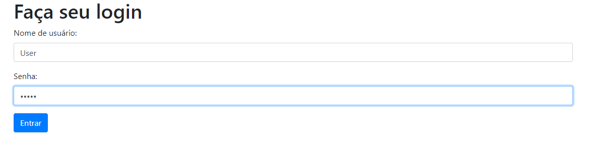

# Python web com flask

  
   

Versao em portugues

Este projeto é uma aplicação web desenvolvida com Flask e Python que tem como objetivo oferecer uma plataforma para uma biblioteca de jogos. Os usuários podem fazer login na plataforma e adicionar novos jogos à biblioteca. O sistema permite a busca por jogos específicos e fornece informações detalhadas sobre cada jogo, incluindo screenshots e descrições. Além disso, os usuários podem avaliar e comentar sobre cada jogo. Este projeto é uma ótima oportunidade para aqueles que buscam praticar suas habilidades em Flask e Python e criar uma aplicação web útil e divertida.

  
  
  
  

English version

This project is a web application developed with Flask and Python that aims to offer a platform for a game library. Users can log in to the platform and add new games to the library. The system allows for search for specific games and provides detailed information about each game, including screenshots and descriptions. Additionally, users can rate and comment on each game. This project is a great opportunity for those seeking to practice their Flask and Python skills and create a useful and fun web application.
